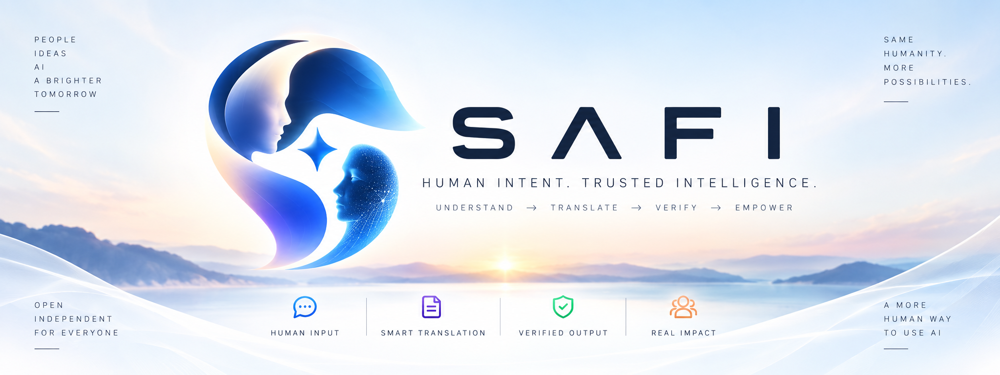

# SAFI

[](https://github.com/valeriobitzone-png/safi/actions/workflows/ci.yml)
[](LICENSE)
[](https://github.com/valeriobitzone-png/safi/releases/tag/v0.1.0)

**The bidirectional interface between humans and AI.**

SAFI turns natural human intent into AI-ready requests, then verifies,
evaluates and humanizes AI responses before they are shown back to the user.

<p align="center">
  
</p>

<p align="center">
  <a href="#why-safi">Why SAFI</a> ·
  <a href="#current-implementation">What works today</a> ·
  <a href="#technical-depth">Technical depth</a> ·
  <a href="docs/GETTING_STARTED.md">Getting started</a> ·
  <a href="docs/ARCHITECTURE.md">Architecture</a>
</p>

```
Human  →  SAFI  →  AI  →  SAFI  →  Human
        compose        verify
        translate      humanize
```

## What you get in five bullets

- **Natural-language intent translation** — say it the way you would say it
  to a person; SAFI preserves informal intent instead of forcing you to
  learn prompt craft.
- **Provider-neutral prompt composition** — one `PromptBlueprint` for any
  model. No provider vocabulary leaks into the request you send.
- **Exact-response verification** — the certificate is bound by SHA-256 to
  the exact text you were shown, not to a later paraphrase of it.
- **Fulfillment and completeness judging** — truth, fulfillment and
  completeness are scored as three separate questions, never collapsed
  into one vague "quality" number.
- **Floating companion** — a small always-available surface beside the AI
  you already use, on desktop and Android.

## Why SAFI?

Most "AI wrapper" projects pipe your text to an API and return what comes
back. SAFI is a **protocol layer**, not a wrapper: it defines a request
shape, a verification scope, a certificate and a trust state machine, and
everything else — models, search, browsers, UI — sits outside the core as
an adapter.

That distinction has practical consequences:

| | A wrapper | SAFI |
|---|---|---|
| Request | a string you had to engineer | a structured intent with constraints preserved |
| Answer | whatever the model returned | captured exactly, hashed, bound to a certificate |
| Quality | an opaque score, if any | three separated questions with deterministic aggregation |
| Provider | baked in | `TransportAdapter` — any provider, any surface |
| Failure | silently wrong | fail-closed: no evidence means `UNCERTAIN`, never `VERIFIED` |

`VERIFIED` means the declared checks passed. It does **not** mean absolute
truth, high quality, completeness or safety — see
[docs/TRUST_MODEL.md](docs/TRUST_MODEL.md).

## Current implementation

Everything below is in this repository and exercised by the test suite:

- **ChatGPT Companion** and **Gemini Companion** — DOM-only site adapters
  behind a provider registry; an unknown host installs nothing at all.
- **macOS floating widget** — loopback-only bridge with session tokens,
  shipped as a packaged app in [`release/`](release/BUILD_REPORT.md).
- **Android `TYPE_APPLICATION_OVERLAY` companion** — behind an explicit
  permission; overlay denied means the manual path, not a hidden fallback.
- **Universal Prompt Composer** — intent → `PromptBlueprint` → rendered
  provider-neutral prompt.
- **Fulfillment / Completeness Judge** — requirement-level scoring over
  the response, separate from evidence checks.
- **AI → Human Translator** — restates an answer in clearer human language
  before you read it.
- **Reference UX projection** — a zero-dependency Web Component, with
  static states you can open in a browser today:
  [`ui/mocks/desktop.html`](ui/mocks/desktop.html),
  [`ui/mocks/mobile.html`](ui/mocks/mobile.html),
  [`ui/mocks/companion.html`](ui/mocks/companion.html).

**Status:** CI passing · typecheck clean · 9/9 conformance vectors ·
test suite green with dev-tree-dependent suites reporting as `todo`
rather than failing on a clean checkout.

**Platforms:** desktop (macOS packaged; Windows build path documented) ·
Android (architecture + working mock) · iOS (architecture + working mock;
a global overlay is platform-forbidden). Honesty about what is mature and
what is not lives in [docs/DEVELOPMENT.md](docs/DEVELOPMENT.md).

## Technical depth

The choices that make this more than a thin client:

- **Provider-neutral core** — [`src/`](src) contains no provider, no
  browser and no `process.env` reference; a structural test enforces it.
- **`TransportAdapter`** — the boundary that carries a request to any AI
  system ([src/transport.ts](src/transport.ts)).
- **`CompanionSiteAdapter`** — provider-specific DOM logic isolated outside
  the core, so a provider UI change never touches trust semantics
  ([packages/companion/](packages/companion)).
- **`PromptBlueprint`** — structured prompt authoring with explicit
  constraints and declared clarification questions
  ([packages/prompt-blueprint/](packages/prompt-blueprint)).
- **Claim model** — factual claims handled individually rather than as one
  opaque block ([packages/claims/](packages/claims)).
- **Evidence verification** — swappable verifiers, injectable fetch, and a
  calculation verifier that is model-independent
  ([packages/verifier-source/](packages/verifier-source),
  [packages/verifier-calculation/](packages/verifier-calculation)).
- **Exact visible-text SHA-256** — the certificate binds the text you saw.
- **Streaming protection** — a response is judged only after it stabilizes;
  mid-stream text never receives a trust state.
- **Mutation guard** — if the DOM changes after capture, the verification
  aborts instead of certifying text that is no longer on screen.
- **Permission model** — consent-first capabilities; an undeclared
  capability cannot be granted ([packages/host-contract/](packages/host-contract)).
- **Trust states** — `VERIFIED | UNCERTAIN | FAILED` only, aggregated
  deterministically; a broken verifier yields `INCONCLUSIVE`, never `PASS`.

Read the full reasoning in [docs/ARCHITECTURE.md](docs/ARCHITECTURE.md) and
[docs/TRUST_MODEL.md](docs/TRUST_MODEL.md).

## Getting started

```bash
git clone https://github.com/valeriobitzone-png/safi.git
cd safi
npm ci
npm run build
npm test              # UI color semantics + vitest suite
node tests/run-conformance.mjs   # 9 protocol vectors
```

Then open [`ui/mocks/desktop.html`](ui/mocks/desktop.html) in a browser to
see the reference surface, or `npm run demo` for a local end-to-end run.

Details: [docs/GETTING_STARTED.md](docs/GETTING_STARTED.md) ·
Day-to-day commands: [docs/DEVELOPMENT.md](docs/DEVELOPMENT.md)

## Trust model in brief

An empty verification scope can never be `VERIFIED`.

```text
no required checks   -> UNCERTAIN
missing check        -> UNCERTAIN
all PASS             -> VERIFIED contributing
PASS + FAIL          -> UNCERTAIN (conflict)
PASS + INCONCLUSIVE  -> UNCERTAIN (conflict)
FAIL + INCONCLUSIVE  -> FAILED
```

Optional checks never change the trust status. A broken verifier can never
produce `PASS`; verifier exceptions are captured as `INCONCLUSIVE`. The
humanizer runs **before** final verification, and the certificate binds the
exact text shown to the human.

## Project status

- **Core protocol:** stable for this preview.
- **Reference runtime:** usable and tested.
- **Companion adapters:** intentionally encapsulated; they can change as
  provider UIs change.
- **Verifier coverage:** depends on the available check types and evidence.
- **Native distribution:** documented where relevant, not claimed complete
  for every platform.

SAFI v0.1 is a **Developer Preview**. It does not claim to be always
correct, to guarantee truth, or to be complete for every provider or
surface.

## Repository layout

```
src/          core protocol: types, engine, transport, translate, verify
packages/     adapters, verifiers, transports, client, widget, companion, demo
apps/         desktop, Android, iOS shells; browser companion extension
ui/           reference UX projection (zero-dependency Web Component)
docs/         architecture, trust model, getting started, development
tests/        vitest suite, conformance vectors, conformance runner
schemas/      JSON Schema contracts
examples/     runtime examples and example payloads
golden/       canonical visual references
rfcs/         protocol decisions and extensions
tools/        schema validation, staging, release helpers
```

## Trust, privacy and brand

Software: [Apache License 2.0](LICENSE).

Brand assets — the SAFI name, logos, mascot and character artwork — are
**not** licensed under Apache-2.0 and remain all rights reserved. See
[BRAND-ASSETS-LICENSE.md](BRAND-ASSETS-LICENSE.md).

Third-party components are listed in
[THIRD_PARTY_NOTICES.md](THIRD_PARTY_NOTICES.md).

## Contributing

See [CONTRIBUTING.md](CONTRIBUTING.md).

## Security

Report vulnerabilities per [SECURITY.md](SECURITY.md).

## Changelog

See [CHANGELOG.md](CHANGELOG.md). Code of conduct:
[CODE_OF_CONDUCT.md](CODE_OF_CONDUCT.md).
